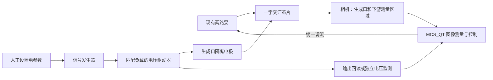

# 电场辅助十字交汇生成：首版落地规格

日期：2026-09-15。配套[文献与创新评估](active_droplet_generation_innovation_20260915_zh.md)。本文件规定第一台原型如何验证；尚非已完成加工图、接线图或已实测控制器。

范围说明：按用户最新要求，当前保持多方向调研；本文件作为“如何把一条路线细化到可执行层面”的示例，不代表项目已选定电场路线或要求现在提供具体芯片参数。

**2026-09-16 条件更正：现有信号发生器不能通过代码调节。因此当前电场路线只能人工设置电参数、图像测量，或固定电参数后由图像闭环调泵。下文涉及自动调电场、驱动器接口和联动控制的内容均为未来新增可编程硬件后的条件方案，不代表当前设备能力。多方向选题以[最新 18 条路线调研](vision_droplet_innovation_literature_20260916_zh.md)为入口。**

## 1. 第一台原型只解决一个问题

**在现有两路供液和相机条件下，用生成口附近的隔离电极获得可重复的液滴体积调节，再接入图像反馈。**

首版固定电场载波频率，控制幅值，不同时优化所有波形参数。已有 DEP 分选保留为后续集成目标；第一轮单独评价生成口，便于确定因果关系。

直接依据：[Tan 2014 交流场辅助流动聚焦](https://doi.org/10.1039/C3LC51143J)、[Wang 2019 液态金属电极切滴](https://pmc.ncbi.nlm.nih.gov/articles/PMC6915379/)。后者不是相同的交流流动聚焦装置，不能直接复制参数。

## 2. 电极怎么放：确定布局原则，按实际几何定尺寸

以分散相沿 x 方向进入交汇、连续相从 ±y 方向进入、液滴沿 +x 输出为坐标约定，实际相位映射以芯片为准。

候选首版是在生成口下游两侧放置对置电极腔，使作用区域覆盖液舌及颈部附近。电极由完整绝缘壁与流体隔离，两侧对称以减少不希望的横向偏移；先不加入复杂多电极阵列。是否能覆盖实际颈部需要显微视频确认。

必须确定的加工参数：

| 参数 | 如何取得 | 决定什么 |
|---|---|---|
| 主流道口宽 w、高 h | 芯片图纸/加工记录；俯视显微图不能直接量 h | 电场作用尺度和体积标定 |
| 两侧绝缘壁厚 t | 设计图与加工公差 | 场衰减、绝缘完整性 |
| 电极前端相对交汇位置 x、覆盖长度 l | 无电场视频中的液舌与断裂位置分布 | 是否真正作用于生成过程 |
| 电极腔截面、入口及导线连接方式 | 现有电极工艺和加工能力 | 可灌注性、接触稳定性 |
| 芯片材料、油水导电率/介电性质 | 材料记录与实测 | 频率响应和驱动负载 |

若现有芯片没有电极腔，不能仅靠在顶面滴一团金属就视为改装完成。可选择复制现有流道并加侧电极腔，或评估贴合外电极；后者因隔层更厚、几何不同，要先证明有效场能到达界面。芯片若可复刻，优先前者。

液态金属电极是否优于现有分选电极工艺，以加工难度和重复性决定。图纸未提供前，不指定微米尺寸或电压上限。

## 3. 驱动与信号连接

这张图表达功能关系，不是未确认设备型号的电气接线图。高压探头、触发线、参考地与输出极性的具体连接必须按现有仪器端口规格确定；不能把高压输出直接接相机或采集卡。

适配驱动器需要核实：交流幅值定义（Vpp/Vpeak/Vrms）、频率范围、输入输出增益、负载电容、输出使能、通信协议、触发延迟和关闭后的残余输出。正弦波只有在零直流偏置下才可用 `Vrms=Vpp/(2√2)`；其他波形单独换算。

当前采用人工设置驱动器、软件采集与标注，以验证物理可行性。未来若新增可编程驱动硬件，自动调电场前必须实现输出限幅、回读/监测和失联关闭路径；不能假设编写通信驱动就能使现有仪器可编程。无法通信读回的量应明确标为设定值。

## 4. 图像怎么测，怎样避免假效果

第一版反馈只用**脱离强电场、位于固定截面区域的滴体积或等效球径**。电场可能只是把滴拉长；若测量区域就在电极旁，投影长度变化会误当成体积变化。

生成口另设状态 ROI，初期只分类稳定断滴、长液舌/射流、异常卫星滴及不可判定，不把尚未验证的颈部预测纳入闭环。能同时覆盖两 ROI 时用同一帧；不能覆盖时先分别采集机制视频和最终质量视频，不能宣称同时观察。

时序步骤：

1. 记录参数改变时间与实际输出改变时间（可获取时）。
2. 通过阶跃视频辨识到下游测量点的总响应与传播延迟。
3. 延迟内的过渡滴单独保存，不能混入稳定反馈窗口。
4. 每个滴只计一次；有缺帧、体积标定失效或样本不足的窗口不更新控制。

与项目现有过线计数共享时间基准，但不能将两条 ROI 的事件按相同时间戳强行对应。平均直径、频率和 CV 必须注明使用哪些滴、哪个时间窗口。

## 5. 第一轮实验表与决策

先选择一个无电场稳定基准 `(Qd0, Qc0)`。下面的 A1、A2 是器件与驱动器已确认允许区间内的小幅有效值电压，不是预设物理数字。

| 实验 | 输入 | 需要回答的问题 |
|---|---|---|
| B0 | 电场关闭 | 基准波动、真实尺寸与频率是否可测？ |
| E1 | 固定载波，幅值 A1 | 输出是否超出基准波动？ |
| B1 | 关闭，回基准 | 效果是否可逆，是否存在漂移？ |
| E2 | 同载波，幅值 A2 | 是否存在局部可标定的响应趋势？ |
| B2 | 再次关闭 | 芯片/流体是否已不可逆变化？ |
| R | 在独立重复中重做 E1/E2 | 响应方向和幅度是否重复？ |

只有通过这些项目，再扩展到其他载波频率及其他流量点。记录电压/频率口径、温度和电流，分辨电场效应与加热效应；观察数十个短时片段不替代独立重复。

判断与解决路径：

| 结果 | 排查与下一动作 |
|---|---|
| 完全无变化 | 先核实驱动真实输出，再检查电极位置/绝缘厚度、流体导电率和有效频段；达到已验证边界仍无效则调整结构，不继续盲目升压。 |
| 只有形状改变 | 移到电场外测体积；体积无变化则该布局暂不满足调滴目标。 |
| 尺寸改变但 CV 明显恶化 | 降低幅值，避开状态转换区；检验频率与液体配方依赖。 |
| 只出现慢漂移 | 与温度变化和关闭后的恢复对照；将其视为慢效应，不宣称快速断滴控制。 |
| 有效但迟滞明显 | 分别辨识升/降幅曲线，限制工作区和变化率；必要时加入历史状态。 |
| 只有生成口有效，下游发生合并 | 改进收集段稳定性，并将合并率纳入验收；不能只报告生成口 CV。 |

## 6. 控制器怎么做：先辨识，再选择可用控制方向

固定载波时，将电场输入暂记为 `a=Vrms²`，只是电应力常见二次依赖启发的局部参数化，不保证跨工况线性。用实测数据拟合 `ΔV=Kv·Δa` 及总延迟；若局部方向不可靠或响应低于测量不确定度，不授权该区间闭环。

单输入首版：保持供液，使用局部 PI 调 a，加入电压上限、变化率限制、饱和积分处理和失效窗口冻结。供液与辅助电场不由两个独立控制器同时争抢同一个尺寸误差；先固定泵验证电场回路，再让统一分配器改变泵工作点。

双目标阶段：测定工作点附近的尺寸/频率对各输入的灵敏度及延迟，用归一化后的矩阵判断独立性和病态程度。固定分散相稳态供液时 `Qd=f·平均体积`，不接受违反体积守恒的目标。额外执行器的价值应表现为更好的可达范围、响应或抗扰，而非虚构新的物理自由度。

## 7. 对现有代码的具体接入点

以下是拟实施修改，尚未执行：

| 现有位置 | 拟增能力 | 必须验证 |
|---|---|---|
| `backend/orchestrator/models.py` 的 `SystemConfig`/`ControlSnapshot` | 辅助源配置、设定/回读、限幅状态和标定身份 | 旧配置兼容，未配置源时维持原流程 |
| `backend/orchestrator/service.py` 的初始化、运行和安全停止路径 | 辅助源生命周期与唯一写权限 | 暂停、停止、失联、过期命令及启动回滚 |
| `backend/vision/detector.py` 与视觉结果适配层 | 独立生成状态特征，下游尺寸继续原标定 | 电场形变、模糊和卫星滴样本的人工标注对照 |
| `backend/pid_control/` | 电场局部辨识及受约束协调器 | 时延、负增益、饱和、错误目标、无效窗口 |
| 新增辅助硬件适配模块 | 具体仪器驱动与模拟驱动 | 超时、错误回复、输出关闭确认 |

现有 `DiameterPIDController` 的输出是泵命令，不能把电压伪装成 Q1/Q2 接进去。真实驱动器型号明确后，才选通信库/协议并实现适配。

软件验证顺序：录制数据离线回放 → 模拟执行器和故障注入 → 完整项目测试 → 人工监督下的台架小范围闭环。模拟测试只能证明软件逻辑，不能证明真实液滴调节效果。

## 8. 我能完成的交付与实际依赖

- 可完成：文献证据核对、带尺寸依据的布局设计、控制与辨识方案、驱动和界面接入、回归测试、实验数据分析与结果报告。
- 需要实际装置输入：芯片截面/电极工艺、仪器型号与接口、液体参数和清晰视频。缺这些不能给出可靠加工尺寸和驱动范围。
- 需要实际加工与台架验证：电极制造、封装、场效应和连续运行性能。设计或代码通过不等于这一步完成。

当前交付是 20 篇原始研究的证据表和这一份首版落地规格；芯片尺寸与驱动器确认后，下一份交付应是确定尺寸的电极布局与匹配仪器的控制实现。
